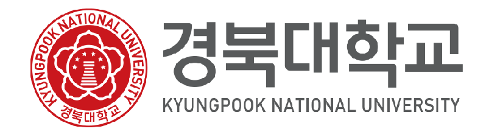

# 경북대학교 사회과학대학
## College of Social Sciences, Kyungpook National University

  

  
  

---

## 대학 소개

경북대학교 사회과학대학은 1952년 창립 이래, 사회 현상을 과학적으로 분석하고
민주시민 양성과 지역사회 발전에 기여하는 인재를 육성해 온 대한민국 대표 사회과학 교육기관입니다.

---

## 대학개요

뿌리 깊은 나무일수록 모진 풍파를 잘 이겨내듯이, 기초학문이 튼튼할수록 험한 세파를 헤쳐 나갈 수 있다. 경북대학교 사회과학대학은 우리 학생들이 앞으로 세상이 어떻게 변하더라도 자기 직업에 충실할 뿐만 아니라, 세계 어느 곳에서도 다른 사람들과 잘 어울릴 수 있고, 지역 사회는 물론 인류공동체에 이바지하는 인재로 커가도록 하는 대학이다.
여태까지 많은 사람들한테 국립대학교는 등록금 싼 것이 경쟁력이라는 인상을 강하게 심어 왔다. 한편 자녀 교육에 대한 관심은 좋은 대학에 진학하는 순간에 급감해가는 경향이 짙었다. 하지만 오늘날 전문 경력에서 가장 큰 영향을 미치고 있는 것은 대학교육부터라고 하겠다. 그만큼 대학 학력은 누구나 갖춰야 하는 필요조건이 되었기 때문에, 이제는 대학 학부에서 진정 충실한 교육을 받았는지, 그리고 그 기초에 전공심화 및 전문능력 함양을 위해 대학원 이상의 교육투자를 어느 정도 하는지에 따라서 평가를 달리해가는 현실이다.

---

## 비전

"달구벌 긍지 넘어, 글로벌 으뜸으로" 세계 100대 대학, 꿈은 이루어진다.

---

## 학과 구성

| 학과 | 주요 연구 분야 |
|------|--------------|
| 정치외교학과 | 정치이론, 국제관계, 외교정책 |
| 사회학과 | 사회구조, 사회변동, 문화사회학 |
| 심리학과 | 임상심리, 인지심리, 상담심리 |
| 지리학과 | 지역개발, GIS, 도시지리 |
| 문헌정보학과 | 도서관학, 정보서비스, 디지털아카이브 |
| 신문방송학과 | 저널리즘, 미디어, 커뮤니케이션 |
| 사회복지학부 | 복지정책, 사회서비스, 지역복지 |

---

## 교육 목표

- **비판적 사고** — 사회현상에 대한 과학적 분석 능력 함양
- **실천적 역량** — 현장 중심의 문제 해결 능력 배양
- **글로벌 마인드** — 국제화 시대에 맞는 글로벌 역량 강화
- **지역 기여** — 지역사회 발전에 기여하는 전문 인재 양성

---

## 오시는 길

- **주소**: 대구광역시 북구 대학로 80 경북대학교 사회과학대학
- **대표전화**: 053-950-5200
- **이메일**: social@knu.ac.kr

---

## 관련 링크

- [경북대학교 공식 홈페이지](https://www.knu.ac.kr)
- [사회과학대학 홈페이지](https://social.knu.ac.kr)
- [입학처](https://admission.knu.ac.kr)

---

  © Kyungpook National University, College of Social Sciences. All rights reserved.

